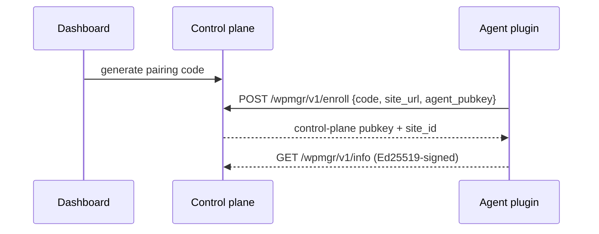

# WordPress agent

The WPMgr agent is an MIT-licensed WordPress plugin (`apps/agent`, PHP 8.0+)
installed on each managed site. It exposes a REST namespace `wpmgr/v1` and talks
to the control plane over **Ed25519-signed** requests. No third-party telemetry.

> **V0 skeleton.** The plugin installs, activates, and serves the signed
> `/wpmgr/v1/info` endpoint. The dashboard pairing exchange is the intended
> setup flow, implemented in Phase 5 / milestone M2 (marked below).

## Install

**Option A — upload the zip (WordPress admin):**

1. Build or download `wpmgr-agent.zip` (see [Build the zip](#build-the-zip)).
2. WP Admin → Plugins → Add New → Upload Plugin → choose the zip → Install Now.
3. Click **Activate**.

**Option B — drop into `wp-content/plugins`:**

```bash
unzip wpmgr-agent.zip -d /path/to/wp-content/plugins/
# then activate in WP Admin → Plugins, or:
wp plugin activate wpmgr-agent
```

## Pair with the dashboard

> **Intended setup flow — Phase 5 / M2.** Pairing is the designed enrollment
> path; for the V0 skeleton, install + activate and confirm the signed
> `/wpmgr/v1/info` endpoint responds.

1. In the dashboard, click **Add site** → copy the one-time **pairing code**.
2. In WP Admin → **WPMgr** settings, paste the pairing code and your control
   plane URL, then **Connect**.
3. The plugin generates its Ed25519 keypair, posts its public key + site URL to
   the control plane, and the control plane verifies the code and stores it.
4. The site shows **online** in the dashboard.



## Security model

- **Ed25519-signed requests** both directions. Each side verifies the other's
  signature against the public key exchanged at enrollment — a compromised
  network can't forge agent or control-plane calls.
- **No telemetry.** The agent only communicates with the control plane URL you
  configure. It phones no third party home.
- **Untrusted by the control plane.** The agent runs on a possibly-compromised
  WordPress host, so the control plane treats all agent-supplied data as
  untrusted and schema-validates it.

Locked crypto: Ed25519 (signing), AES-256-GCM (at-rest secrets), blake3
(integrity), age (backup encryption). Details in [security.md](./security.md).

## Build the zip

```bash
make agent-zip
# → release/wpmgr-agent.zip (excludes vendor/, tests/, *.dist)
```

Develop and test the plugin locally:

```bash
cd apps/agent
composer install
composer test     # PHPUnit (+ Brain Monkey), see ADR-021
```

Entrypoint is `wpmgr-agent.php`; classes autoload from `includes/`
(PSR-4 `WPMgr\Agent\`).
