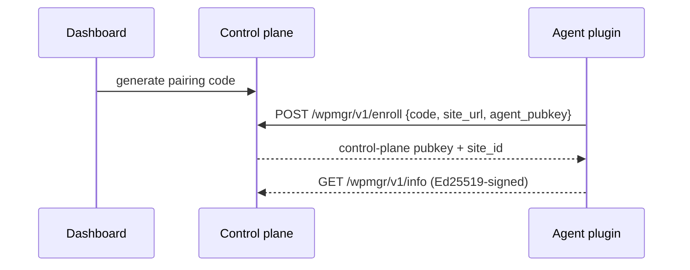

# WordPress agent

The WPMgr agent is an MIT-licensed WordPress plugin (`apps/agent`, PHP 8.0+)
installed on each managed site. It exposes a REST namespace `wpmgr/v1` and talks
to the control plane over **Ed25519-signed** requests. No third-party telemetry.

> **V0 skeleton.** The plugin installs, activates, and serves the signed
> `/wpmgr/v1/info` endpoint. The dashboard pairing exchange is the intended
> setup flow, implemented in Phase 5 / milestone M2 (marked below).

## Install

**Option A — upload the zip (WordPress admin):**

1. Build or download `wpmgr-agent.zip` (see [Build the zip](#build-the-zip)).
2. WP Admin → Plugins → Add New → Upload Plugin → choose the zip → Install Now.
3. Click **Activate**.

**Option B — drop into `wp-content/plugins`:**

```bash
unzip wpmgr-agent.zip -d /path/to/wp-content/plugins/
# then activate in WP Admin → Plugins, or:
wp plugin activate wpmgr-agent
```

## Pair with the dashboard

> **Intended setup flow — Phase 5 / M2.** Pairing is the designed enrollment
> path; for the V0 skeleton, install + activate and confirm the signed
> `/wpmgr/v1/info` endpoint responds.

1. In the dashboard, click **Add site** → copy the one-time **pairing code**.
2. In WP Admin → **WPMgr** settings, paste the pairing code and your control
   plane URL, then **Connect**.
3. The plugin generates its Ed25519 keypair, posts its public key + site URL to
   the control plane, and the control plane verifies the code and stores it.
4. The site shows **online** in the dashboard.



## Heartbeat & connection lifecycle

> **Phase 5.7 / agent `0.10.1-revoke-verify`.** The lifecycle behaviours below
> ship in agent version `0.10.1`. Full guide:
> [features/site-lifecycle.md](./features/site-lifecycle.md). Design:
> [ADR-039](./adr/ADR-039-heartbeat-cadence-timeouts.md),
> [ADR-040](./adr/ADR-040-agent-last-will-disconnect.md).

The agent posts a **60-second** signed heartbeat (WP-Cron `wpmgr_agent_heartbeat`
on the `wpmgr_60sec` schedule) to `POST /agent/v1/heartbeat`. The control plane
uses heartbeat freshness to drive the connection state: fresh ≤180s →
`connected`; ≥180s → `degraded`; ≥360s → `disconnected`. On a successful enroll
the agent also fires **one heartbeat immediately** so the dashboard flips to
`connected` within ~1s instead of waiting for the first tick.

> **No-traffic / no-cron caveat.** WP-Cron only fires on site traffic. A
> low-traffic site can go minutes between page loads, so it may read `degraded`
> or `disconnected` despite being healthy. Drive wp-cron from the system crontab
> instead:
>
> ```cron
> * * * * * curl -s 'https://your-site.example/wp-cron.php?doing_wp_cron' >/dev/null 2>&1
> ```
>
> (Optionally also `define('DISABLE_WP_CRON', true);` in `wp-config.php` so the
> heartbeat is driven *only* by the system cron above.) This is a documented,
> accepted limitation of traffic-gated WP-Cron.

**Last-will on deactivate / uninstall.** When the plugin is deactivated or
uninstalled, WordPress fires the corresponding hook and the agent posts a
**signed** last-will `POST /agent/v1/disconnect` (`reason: deactivated |
uninstalled`). It is **best-effort with a 3-second timeout** — a failure never
blocks deactivation; the control plane's heartbeat-timeout sweeper is the safety
net (≤360s). Deactivate leaves the keys in place (it may be temporary);
uninstall additionally wipes key material and drops the agent's options.

**Signed revoke teardown.** A dashboard-initiated **revoke** is returned to the
agent as a `revoke` instruction on its next heartbeat (≤60s), accompanied by a
**signed revoke token** — a short-lived Ed25519 JWT (`cmd="revoke"`,
`aud=<site_id>`) minted by the control plane's command signer. The agent
**verifies that token** (signature against the stored control-plane public key,
`exp`, `aud == own site_id`, `cmd == "revoke"`, single-use `jti`) **before**
wiping its keys + self-deactivating. It **fails closed**: an absent, forged,
expired, replayed, or wrong-audience token is ignored and no teardown happens —
TLS trust alone cannot force a destructive self-deactivation. See the
[ADR-040 addendum](./adr/ADR-040-agent-last-will-disconnect.md#addendum-2026-05-31---signed-revoke-instruction-phase-6-security-review).

## Security model

- **Ed25519-signed requests** both directions. Each side verifies the other's
  signature against the public key exchanged at enrollment — a compromised
  network can't forge agent or control-plane calls.
- **No telemetry.** The agent only communicates with the control plane URL you
  configure. It phones no third party home.
- **Untrusted by the control plane.** The agent runs on a possibly-compromised
  WordPress host, so the control plane treats all agent-supplied data as
  untrusted and schema-validates it.

Locked crypto: Ed25519 (signing), AES-256-GCM (at-rest secrets), blake3
(integrity), age (backup encryption). Details in [security.md](./security.md).

## Media Optimizer

> **M23 / Phase 7.** Encoding runs off-host on WPMgr's optional `media-encoder`
> service; the agent uploads sources, applies the optimized outputs on disk, and
> installs the Accept-header fallback. User guide:
> [features/media-optimizer.md](./features/media-optimizer.md). Architecture:
> [architecture/media-optimizer.md](./architecture/media-optimizer.md).

**No Imagick/GD required.** The agent does **no** image encoding. It reads source
bytes from disk, presigned-PUTs them to object storage, and later downloads the
optimized variants and writes them back — all encoding happens in the
control-plane `media-encoder` service (`lilliput`). A host without the Imagick or
GD PHP extensions optimizes images perfectly fine; the agent only does file I/O,
the DB URL rewrite, and the `.htaccess` install.

### The `.htaccess` Accept-header block (Apache)

When you optimize **JPEG → AVIF/WebP**, the new file is written next to the
untouched original and the DB references the modern URL. The agent installs an
idempotent block between `# BEGIN WPMgr Media` / `# END WPMgr Media` markers (WP
managed-block convention — writing twice yields exactly one block) that serves
the legacy twin only when the browser did not advertise the modern format **and**
the twin exists on disk:

```apache
# BEGIN WPMgr Media
<IfModule mod_rewrite.c>
	RewriteEngine On

	# AVIF fallback: no AVIF support -> serve png/jpg/jpeg twin if it exists.
	RewriteCond %{HTTP_ACCEPT} !image/avif [NC]
	RewriteCond %{DOCUMENT_ROOT}/$1.png -f
	RewriteRule ^(.+)\.avif$ $1.png [L]
	# (same pair of rules for .jpg and .jpeg)

	# WebP fallback: no WebP support -> serve png/jpg/jpeg twin if it exists.
	RewriteCond %{HTTP_ACCEPT} !image/webp [NC]
	RewriteCond %{DOCUMENT_ROOT}/$1.png -f
	RewriteRule ^(.+)\.webp$ $1.png [L]
	# (same pair of rules for .jpg and .jpeg)
</IfModule>

<IfModule mod_headers.c>
	<FilesMatch "\.(avif|webp)$">
		Header merge Vary Accept
	</FilesMatch>
</IfModule>
# END WPMgr Media
```

The `-f` guard means a missing twin never 404s; `Vary: Accept` stops shared
caches/CDNs from serving an AVIF response to a no-AVIF client (and vice-versa).
The block is prepended so it runs ahead of WP's front-controller rewrites.

### nginx equivalent (manual — the agent never edits nginx config)

nginx has no `.htaccess`. The agent detects nginx via `SERVER_SOFTWARE`, **skips
the file edit**, and surfaces an admin notice with the equivalent snippet to add
to your server block:

```nginx
# WPMgr Media: serve AVIF/WebP when the client advertises support, else the legacy twin.
location ~* ^(?<wpmgr_base>.+)\.(?<wpmgr_ext>avif|webp)$ {
    add_header Vary Accept;
    set $wpmgr_modern "";
    if ($http_accept ~* "image/$wpmgr_ext") { set $wpmgr_modern "A"; }
    if (-f $request_filename) { set $wpmgr_modern "${wpmgr_modern}B"; }
    if ($wpmgr_modern = "AB") { break; }
    # Fall back to a legacy twin if one exists (try jpg, then png).
    try_files $wpmgr_base.jpg $wpmgr_base.png $uri =404;
}
```

### Troubleshooting

**Modern images aren't downgrading on an old browser.** On Apache, confirm the
`# BEGIN WPMgr Media` block is present in the site-root `.htaccess` and that
`mod_rewrite` + `mod_headers` are enabled. The downgrade only fires when the
legacy twin still exists on disk — after **Delete originals** there is no twin,
so old browsers can no longer be served the legacy format. On nginx, confirm you
pasted the snippet above (the agent cannot install it for you).

**"Could not write `.htaccess`" notice.** The site-root directory (or the file)
is not writable by the web user. Fix the permissions or paste the block manually
between the markers — the install is idempotent and will leave a hand-placed
block alone if it matches.

## Page cache

> **M36 / Phase 6 (Performance Suite).** The agent installs a standard WordPress
> `WP_CACHE` drop-in and serves anonymous pages from disk. User guide:
> [features/caching.md](./features/caching.md). Architecture:
> [architecture/perf-suite.md](./architecture/perf-suite.md). Design:
> [ADR-046](./adr/ADR-046-performance-suite-architecture.md).

On `cache_enable` the agent sets `define('WP_CACHE', true)` in `wp-config.php`
(atomic temp-file + rename), installs `wp-content/advanced-cache.php`, and on
Apache splices a managed `# BEGIN WPMgr Cache` / `# END WPMgr Cache` block into
the site-root `.htaccess`. Cached pages live at
`wp-content/cache/wpmgr/<host>/<path>/<variant>.html.gz`. A served hit carries
`x-wpmgr-cache: HIT`; a miss carries `MISS`.

The PHP drop-in always serves a hit. A server-level fast-path can short-circuit
to the static `.html.gz` **before** PHP loads.

### CloudPanel Varnish

On CloudPanel sites, the agent detects Varnish from the CloudPanel settings file
under the site user's home directory. When present, manual purges, automatic
content-change purges, and delete-everything purges clear WPMgr's local disk
cache and CloudPanel Varnish together. The optional CloudPanel WordPress plugin
is not required.

Full-site purges also try to remove that host's PageSpeed cache contents when
the CloudPanel PageSpeed cache path exists and is writable by the PHP user. If
the path is absent or not writable, the PageSpeed cleanup is skipped. Per-URL
purges do not remove PageSpeed files.

### nginx location snippet (manual — the agent never edits nginx config)

nginx ignores `.htaccess`, so the agent **cannot** auto-install the fast-path. It
detects nginx via `SERVER_SOFTWARE`, skips the file edit, and surfaces an admin
notice with the equivalent `location` snippet to add inside your `server {}`
block. Until you add it the PHP drop-in still serves every hit.

```nginx
# WPMgr Page Cache — nginx equivalent (add inside your server {} block manually).
set $wpmgr_cache "";
# Only consider the disk cache for anonymous, query-less, cacheable requests.
if ($request_method ~ ^(GET|HEAD)$) { set $wpmgr_cache "M"; }
if ($query_string != "") { set $wpmgr_cache ""; }
if ($http_cookie ~* "wordpress_logged_in|wp-postpass|comment_author|woocommerce_items_in_cart") {
    set $wpmgr_cache "";
}
if ($request_uri ~* "/wp-(admin|login|register|comments-post|cron|json)") {
    set $wpmgr_cache "";
}

location / {
    # Block direct hits on cache files.
    location ~* /wp-content/cache/wpmgr/.*\.html\.gz$ { internal; }

    # Serve the pre-gzipped page when a cache file exists and $wpmgr_cache == "M".
    if (-f "$document_root/wp-content/cache/wpmgr/$host$uri/index.html.gz") {
        set $wpmgr_cache "${wpmgr_cache}F";
    }
    if ($wpmgr_cache = "MF") {
        add_header Content-Encoding gzip;
        add_header X-WPMgr-Cache HIT;
        add_header Cache-Control "no-cache, must-revalidate";
        rewrite ^ /wp-content/cache/wpmgr/$host$uri/index.html.gz break;
    }

    try_files $uri $uri/ /index.php?$args;
}
```

**Verify** the fast-path is taking effect: load a published page twice as an
anonymous visitor, then check the response header.

```bash
curl -sI https://your-site.example/some-post/ | grep -i x-wpmgr
# x-wpmgr-cache: HIT
# x-wpmgr-source: Web Server   # nginx/Apache fast-path; "PHP" = drop-in served it
```

`x-wpmgr-source: PHP` means the drop-in served the hit (correct, just not the
server fast-path) — recheck the snippet path and that the `.html.gz` exists on
disk.

### OpenLiteSpeed / LiteSpeed

Detected via `LSWS_EDITION`. The agent **strips its own gzip/deflate section**
from the `.htaccess` block, because the server already compresses and
double-gzipping a `.html.gz` corrupts the response. The serve rules stay; the
server handles compression. No action needed.

### WP Engine / managed Atomic hosts

These platforms ship their own `advanced-cache.php`. The agent detects them (the
`Atomic_Persistent_Data` class) and installs **under the alternate filename**
`wpmgr-advanced-cache.php` rather than clobbering the platform's drop-in,
degrading to leave the platform-owned page cache in place where it is managed.

### Troubleshooting

**Cache not serving (every response is `MISS`).** Confirm the cache is enabled
for the site, and that the request is actually cacheable: it must be an anonymous
(no `wordpress_logged_in_*` cookie unless logged-in caching is on), query-less or
known-query, GET request returning a full `<!DOCTYPE html>` page. Admin/auth/API
paths, AJAX, POST, password-protected content, and a URL with an unknown query
param are never cached by design. Check that
`wp-content/cache/wpmgr/<host>/...` exists and is writable by the web user.

**Drop-in conflicts ("another cache plugin owns advanced-cache.php").** The agent
refuses to overwrite a foreign canonical `advanced-cache.php` it does not
recognise as its own — that signals another caching plugin installed it. Disable
or remove the other cache plugin (or its drop-in) and re-run **Enable cache**.
The agent only deletes a drop-in it recognises as ours on disable/uninstall, so
it never removes a competing plugin's file.

**`WP_CACHE` not set / config not writable.** If `wp-config.php` (or its
directory) is not writable by the web user, the agent refuses to write rather
than risk a partial edit; the Cache tab shows `wp_cache_constant_set: false`. Fix
the permissions or add `define('WP_CACHE', true);` manually, then re-run Enable.

**Pages look stale.** Purge the site (Cache tab or
`POST /api/v1/sites/{siteId}/cache/purge`). Auto-purge clears changed URLs on
content edits; if it is not firing, confirm WP-Cron runs (see the no-cron caveat
above) and consider a shorter refresh interval.

## Build the zip

```bash
make agent-zip
# → release/wpmgr-agent.zip (excludes tests/, tools/, *.dist; vendor/ is bundled)
```

Develop and test the plugin locally:

```bash
cd apps/agent
composer install
composer test     # PHPUnit (+ Brain Monkey), see ADR-021
```

Entrypoint is `wpmgr-agent.php`; classes autoload from `includes/`
(PSR-4 `WPMgr\Agent\`).
