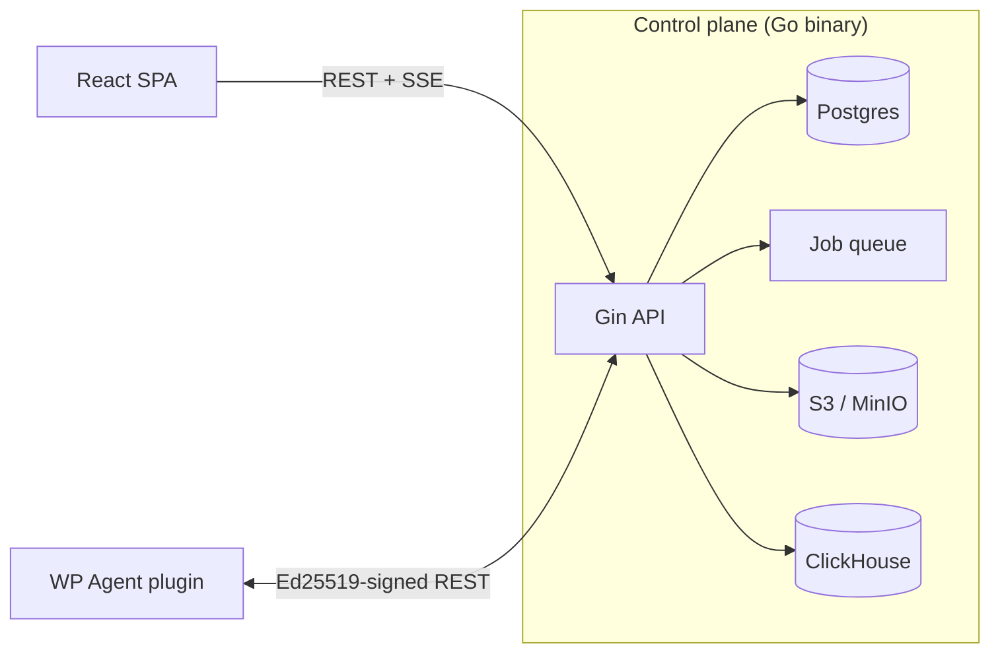

# Architecture

_Full diagrams written by the docs-writer in Phase 4._

```mermaid
flowchart LR
  subgraph ControlPlane["Control plane (Go binary)"]
    API[Gin API]
    DB[(Postgres)]
    Q[Job queue]
    S3[(S3 / MinIO)]
    CH[(ClickHouse)]
  end
  Web[React SPA] -->|REST + SSE| API
  API --> DB
  API --> Q
  API --> S3
  API --> CH
  Agent[WP Agent plugin] <-->|Ed25519-signed REST| API
```
